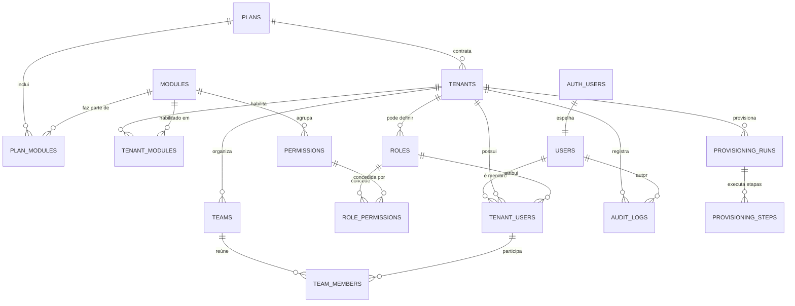

# Banco de dados — Tivexy Core

> Esquema da fundação. Entidades de CRM, ERP, estoque e financeiro vêm depois,
> sobre esta base. Migrations e testes em `supabase/` — ver [[../../supabase/README|supabase/README]].
>
> **Estado:** migrations escritas e verificadas contra Postgres 18 (114 testes
> passando). O projeto Supabase já existe (`tivexy-core`); as migrations ainda
> **não foram aplicadas nele**.

## ERD

## Camadas

| Camada          | Tabelas                                           | Escopo                  |
| --------------- | ------------------------------------------------- | ----------------------- |
| Catálogo        | `plans`, `modules`, `plan_modules`, `permissions` | Global da plataforma    |
| Tenancy         | `tenants`, `tenant_modules`                       | Por tenant              |
| Identidade      | `users`, `tenant_users`                           | Pessoa e vínculo        |
| Autorização     | `roles`, `role_permissions`                       | Sistema + por tenant    |
| Organização     | `teams`, `team_members`                           | Por tenant              |
| Observabilidade | `audit_logs`                                      | Por tenant + plataforma |
| Provisionamento | `provisioning_runs`, `provisioning_steps`         | Plataforma              |

## Convenções

- Chave primária `id uuid` com `gen_random_uuid()`
- `created_at` e `updated_at` em toda tabela mutável, com trigger
- **Toda entidade de negócio carrega `tenant_id`**
- `on delete restrict` por padrão; cascata só quando o filho não faz sentido
  sem o pai
- Valores monetários em tipo exato, **nunca** ponto flutuante (vale para os
  módulos que ainda vão nascer)

## Decisões

### Plano ≠ módulos habilitados

O plano é o pacote comercial; `tenant_modules` é o que está de fato ligado. Um
tenant pode receber um módulo fora do plano — cortesia, piloto, migração — sem
que isso vire um plano novo. A verdade sobre acesso a módulo é
`tenant_modules`, não `plans`.

### Super Admin não é papel de tenant

É `users.is_super_admin`, um sinalizador de plataforma. Um papel de tenant
capaz de "ver tudo" seria escalada de privilégio esperando alguém atribuí-lo
por engano. Super Admin não pertence a tenant nenhum.

### Permissão é dado, não código

`permissions` é catálogo no formato `modulo.recurso.acao` (ex.:
`crm.leads.write`). `role_permissions` liga papel a permissão. Um tenant pode
criar papel próprio sem deploy.

Papéis de sistema têm `tenant_id` nulo e valem para todos; papéis próprios
carregam o `tenant_id`. Como `NULL` não colide com `NULL` em `UNIQUE`, a
unicidade precisa de dois índices parciais em vez de uma constraint só.

### Perfis e permissões padrão

| Papel          | Permissões | Regra                                                                     |
| -------------- | ---------- | ------------------------------------------------------------------------- |
| `tenant_admin` | 51 (todas) | Controle total dentro da empresa                                          |
| `manager`      | 48         | Tudo menos `core.roles.write`, `core.tenant.write`, `core.settings.write` |
| `collaborator` | 21         | Leitura dos módulos de negócio + escrita do dia a dia                     |

O gestor não altera papéis de propósito: quem edita papel se promove a
administrador.

### Membro de equipe aponta para o vínculo, não para o usuário

`team_members.tenant_user_id` referencia `tenant_users`, não `users`. Assim,
sair do tenant remove das equipes automaticamente, e é impossível colocar numa
equipe alguém de outro tenant — o esquema não permite representar isso.

### Convite não é acesso

`tenant_users.status` começa em `invited`. `user_tenant_ids()` só retorna
vínculos `active`, então convite pendente não lê dado nenhum. Uma constraint
garante a coerência: quem entrou tem `joined_at`, quem só foi convidado não.

### Auditoria é append-only

`audit_logs` tem política de `SELECT` e de `INSERT`, e **nenhuma** de `UPDATE`
ou `DELETE`. Com RLS habilitado, ausência de política é negação. Log editável
não é auditoria.

Membro só insere no próprio tenant e não pode forjar o autor — o `with check`
compara `actor_user_id` com `auth.uid()`.

### Idempotência mora no esquema

O provisionamento é prioridade zero, e as três propriedades que ele precisa
ter são garantidas por constraint, não por disciplina da aplicação:

| Propriedade   | Como o esquema garante                                                   |
| ------------- | ------------------------------------------------------------------------ |
| Idempotência  | `idempotency_key` UNIQUE — repetir a requisição devolve a mesma execução |
| Exclusividade | Índice parcial: uma execução viva por tenant                             |
| Retomada      | Uma linha por etapa, `UNIQUE (run_id, step)` — retomar pula o concluído  |
| Compensação   | `provisioning_steps.result` guarda o que precisa ser desfeito            |
| Coerência     | Execução terminada exige `finished_at`                                   |

Regra que depende de a aplicação lembrar não é regra.

## Row Level Security

Detalhe completo em [[../12-SECURITY/MULTI_TENANCY|MULTI_TENANCY]]. O essencial:

O isolamento é garantido **no banco**. Não em filtro de frontend, nem em
`where tenant_id = ?` espalhado pelo código — esquecer o filtro uma vez vaza
dado entre clientes.

Funções auxiliares, todas `SECURITY DEFINER` com `search_path` fixo:

| Função                            | Responde                                 |
| --------------------------------- | ---------------------------------------- |
| `is_super_admin()`                | A pessoa é da equipe Tivexy?             |
| `user_tenant_ids()`               | Em quais tenants ela é membro **ativo**? |
| `is_tenant_member(tenant_id)`     | É membro deste tenant?                   |
| `has_permission(tenant_id, code)` | Tem esta permissão neste tenant?         |

`SECURITY DEFINER` é obrigatório: uma política em `tenant_users` que consultasse
`tenant_users` sob RLS entraria em recursão infinita. `search_path` fixo também:
sem ele, quem controla o search_path da sessão redireciona os nomes não
qualificados e escala privilégio. Um teste verifica as duas coisas.

## Contexto da requisição

| Função                      | Devolve                                                      |
| --------------------------- | ------------------------------------------------------------ |
| `current_viewer(tenant_id)` | Tudo que a aplicação precisa para decidir acesso, em um JSON |
| `my_tenants()`              | Os tenants da pessoa, incluindo convites pendentes           |

`current_viewer()` devolve exatamente o formato do `Viewer` de `@tivexy/core`,
e `decideAccess()` consome isso sem adaptação — há teste que prova.

**Por que uma função e não cinco consultas:** a decisão de acesso acontece em
toda requisição. Cinco idas ao banco por página, mais a latência de cada uma, é
o tipo de custo que ninguém nota até estar em produção.

**Por que ela não vaza**, mesmo sendo `SECURITY DEFINER` (ou seja, rodando por
fora do RLS) — a segurança vem do filtro, e cada item tem teste:

- Tudo é filtrado por `auth.uid()`
- O tenant só aparece para quem tem vínculo com ele. Para um estranho devolve
  nulo: **nem confirma que o tenant existe**
- Permissões só com vínculo **ativo** — o mesmo corte de `user_tenant_ids()`
- Módulos habilitados também só para membro ativo, senão qualquer pessoa
  autenticada descobriria o que outra empresa contratou
- Convite pendente é o caso intermediário: vê o **nome** da empresa, porque a
  tela de convite precisa nomeá-la, e nada além disso

`my_tenants()` inclui convites pendentes de propósito: é na lista de empresas
que a pessoa aceita o convite.

## O que ainda não existe

Entidades de negócio — leads, contatos, empresas, oportunidades, produtos,
clientes, fornecedores, vendas, compras, estoque, movimentações, contas a pagar
e receber, documentos fiscais, integrações, automações e execuções.

Todas nascem com `tenant_id`, RLS e teste de isolamento no mesmo commit.
